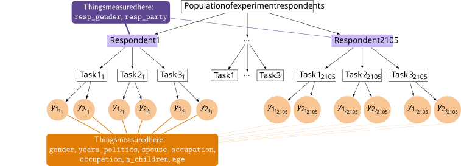

## Setup

```{r}
#| label: packages-data
#| warning: false
#| message: false

library(tidyverse)
library(patchwork)
library(scales)
library(marginaleffects)
library(parameters)
library(mclogit)
library(lme4)
library(brms)
library(tidybayes)

options(
  parameters_cimethod = FALSE,
  parameters_exponentiate = FALSE,
  width = 1000
)

# Nice colors
clrs <- MetBrewer::met.brewer("Tiepolo")

# From the Urban Institute bc why not
# https://urbaninstitute.github.io/graphics-styleguide/#color
party_colors <- c(
  "Democrat" = "#1696d2", 
  "Republican" = "#db2b27", 
  "Independent" = "#fdbf11"
)

# Little helper function for formatting numbers as percentage points
label_pp <- scales::label_number(
  accuracy = 1,
  scale = 100,
  suffix = " pp.",
  style_negative = "minus"
)

# Some lookup tables to help make all the attributes and levels plot in the right order
attributes_levels <- tribble(
  ~attribute, ~attribute_nice, ~level,
  "gender", "Gender", c("Male", "Female"),
  "years_politics", "Years in politics", c("None", "1 year", "3 years", "8 years"),
  "spouse_occupation", "Spouse occupation", c("Unmarried", "Doctor", "Farmer"),
  "occupation", "Occupation", c("Teacher", "Corporate lawyer", "Mayor", "State legislator"),
  "n_children", "Number of children", c("0", "1", "3"),
  "age", "Age", c("29", "45", "65")
)

attribute_lookup <- attributes_levels |> 
  select(-level) |> 
  mutate(attribute_nice = fct_inorder(attribute_nice))

attribute_levels_lookup <- attributes_levels |>
  unnest(level) |> 
  mutate(level_nice = level) |> 
  mutate(across(c("attribute_nice", "level_nice"), \(x) fct_inorder(x)))

candidates <- readRDS("data/candidate.rds")
```

For this example, we'll use the same candidate data from @TeeleKallaRosenbluth2018, but we'll do fancier things with it. For reference, here's the basic OLS model we were working with in Part 1:

```{r}
#| label: base-model
model_lm <- lm(
  choice ~ gender +
    years_politics +
    spouse_occupation +
    occupation +
    n_children +
    age,
  data = candidates
)

thing_ols <- model_parameters(model_lm)
```

That model has two limitations when used for conjoint data: (1) it uses a likelihood that wasn't designed for forced categorical choices, and (2) it pools all observations together (though we kind of took care of that after the fact by calculating standard errors clustered by respondent). There are two separate upgrades we can make: (1) use a model likelihood designed for forced choice situations, and (2) account for respondent-level random effects. We can do each of these with standard frequentist models, but fixing both at the same time requires some Bayesian fun.

## Oh no 3!: OLS is (too?) simple

The {mclogit} package lets us estimate conditional logit models (people---including me!---also call these multinomial logit models, though technically they're different things 🤷‍♂️). Instead of treating each row as an independent binary outcome, conditional logit conditions the likelihood on exactly one option being chosen per task. The formula puts two things on the left-hand side: the binary choice and a choice set ID identifying which two candidates competed:

```{r}
#| label: fit-mclogit
#| 
candidates_mclogit <- candidates |>
  mutate(choice_id = cur_group_id(), .by = c(resp_id, task))

model_clogit <- mclogit(
  choice | choice_id ~ gender +
    years_politics +
    spouse_occupation +
    occupation +
    n_children +
    age,
  data = candidates_mclogit
)

model_parameters(model_clogit)
```

These coefficients are on the log-odds scale, so they're pretty uninterpretable here, though the directions and relative magnitudes match the OLS coefficients (and we'll do *a lot* more with these log-odds coefficients tomorrow!). 

We can calculate probability-scale marginal means with `avg_predictions()`, and they're basically the same, but with better(?) standard errors:

```{r}
#| label: mclogit-mms

avg_predictions(model_clogit, by = "gender")
```

`avg_comparisons()` doesn't work well with {mclogit} objects (or most multinomial logit models, since they're weird already) because of how {mclogit} structures its predictions internally. But since AMCEs are differences in marginal means, we can find the differences ourselves. Or even better, we can have {marginaleffects} do it for us with `hypothesis = ~reference`, which subtracts the reference level from each group:

```{r}
#| label: mclogit-amces

avg_predictions(model_clogit, by = "gender", hypothesis = ~reference)
```

The AMCE for gender is 4.1 percentage points---a little smaller than the OLS estimate of 4.25

```{r}
avg_comparisons(model_lm, variables = "gender", vcov = ~resp_id)
```

::: {.callout-tip title="Your turn 1"}
1. Calculate the MMs and AMCEs for all the attributes using `mclogit()`! Also make a coefficient plot of them. (Refer to the answer key from the previous session!)
2. `mclogit()` and `lm()` give very similar AMCEs despite using completely different likelihoods. Why might this be? Under what conditions would you expect them to diverge more?
:::

```{r}
#| label: your-turn-1

# Do stuff here
```

## Oh no! 4: We're ignoring the nested structure

Remember @fig-candidate-hierarchy from earlier?

::: {#fig-candidate-hierarchy}

{width="100%"}

Multilevel experimental structure, with candidate choices $\\{y_1, y_2\\}$ nested in tasks in respondents

:::

That's a nested structure! There are alternatives inside tasks inside respondents. We're missing that here.

OLS makes life easy and everyone uses it. However, @JensenMarbleScheve2021 argue that OLS throws away too much useful information about (1) the relationships and covariance between the different combinations of feature levels offered to respondents, and (2) individual-specific differences in how respondents react to different feature levels. In effect, it flattens the hierarchy in @fig-candidate-hierarchy-annotated and pools everything together.

Jensen et al. explain three different approaches to analyzing data that has a natural hierarchical structure like conjoint data where lots of choices related to different "products" are nested within individuals:

1. **Pooled data** The easiest way to deal with individual-specific effects is to not to. Lump each choice by each respondent into one big dataset, run OLS on it, and be done. However, this erases all individual-level heterogeneity and details about how different feature levels interact with individual characteristics.

2. **No pooling**: An alternative way to deal with individual-specific effects is to run a separate model for each individual. If 800 people participated in the experiment, run 800 different models. That way you can perfectly model the relationship between each individual's characteristics (political party, age, income, education, etc.) with their choices and preferences. This sounds neat, but has substantial issues. It'll only show an identified causal effect if each respondent saw every combination of conjoint features at least once. Here each respondent would need to see all 864 profiles simultaneously. That's impossible.

3. **Partial pooling** Jensen et al.'s solution is to use hierarchical models that allow individual-level characteristics to inform choice-level decisions. In this kind of model, we want individual-level characteristics like age, income, education, etc. to inform the decision to choose specific outcomes and interact with different feature levels in different ways. Not every respondent needs to have seen all 864 options---information about respondents with similar characteristics facing similar sets of choices gets shared because of the hierarchical-ness of the model.

::: {.callout-tip title="Best overview of multilevel models"}
For the best overviews I've found of how multilevel models work, check out these two resources:

- Chapters 15--17 in [*Bayes Rules!*](https://www.bayesrulesbook.com/) ([especially chapter 17](https://www.bayesrulesbook.com/chapter-17))
- Michael Clark's [*Mixed Models with R* guide](https://m-clark.github.io/mixed-models-with-R/)

[I also have a guide here](https://www.andrewheiss.com/blog/2021/12/01/multilevel-models-panel-data-guide/), but it's nowhere near as good as those ↑
:::

By using a multilevel hierarchical model, @JensenMarbleScheve2021 show that we can still find AMCEs and causal effects, but we can take advantage of the far richer heterogeneity that we get from these complex models.

HOWEVER, frequentist approaches to multilevel models will often struggle with this! You *can* theoretically do it with {mclogit} with a `random` argument:

```{.r}
mclogit(
  choice | choice_id ~ gender +
    years_politics +
    spouse_occupation +
    occupation +
    n_children +
    age,
  data = candidates_mclogit,
  random = ~1 | resp_id
)
```

But you'll get an error with this data.

You can use `lmer()` from {lme4} like this:

```{.r}
model_lmer <- lmer(
  choice ~ gender +
    years_politics +
    spouse_occupation +
    occupation +
    n_children +
    age +
    (1 | resp_id),
  data = candidates
)
```

…and it'll fit! But all the random effects will actually just be zero and have no variance:

```{.r}
performance::icc(model_lmer)
#> Warning: Can't compute random effect variances. Some variance components equal zero.
#> Your model may suffer from singularity.
#> [1] NA
```

## Oh no! 5: We only have point estimates

To get hierarchical models to work consistently, we need to switch to Bayesian modeling. This is incredibly common for conjoint---most of the online conjoint providers estimate *hierarchical Bayesian multinomial logit* models (like [Sawtooth](https://sawtoothsoftware.com/advanced-analytical-tools/cbc-hierarchical-bayes) and [OpinionX](https://knowledge.opinionx.co/en/articles/13870520-technical-overview-hierarchical-bayes-for-conjoint-rank)).

Switching to a Bayesian approach also lets us address the final "Oh no!" here. Bayesian models give us a full posterior distribution for every parameter so that we can explore and report all the uncertainty associated with the estimates. We can also do fancier hypothesis testing, saying things like "there is a 97% chance that the effect is positive" rather than talking about p-values.

### Bayesian multilevel multinomial model

We don't have time to cover Bayesian methods here---there are whole textbooks about it (check out [*Bayes Rules!*](https://www.bayesrulesbook.com/)---it's my favorite!)---so everything that follows here is super simplified and stripped down.

We'll use Stan through {cmdstanr} through {brms} to fit a multinomial model (don't worry! you won't have to think about Stan code at all!) like this:

$$
\begin{aligned}
&\ \textbf{Multinomial probability of selection of choice}_i \textbf{ in respondent}_j \\
\text{Choice}_{i_j} \sim&\ \operatorname{Categorical}(\{\mu_{1,i_j}, \mu_{2,i_j}\}) \\[10pt]
&\ \textbf{Model for probability of each option} \\
\{\mu_{1,i_j}, \mu_{2,i_j}\} =&\ (\beta_0 + b_{0_j}) + \beta_1 \text{Gender[female]}_{i_j} + \\
&\ \beta_2 \text{Years in politics[1]}_{i_j} + \beta_3 \text{Years in politics[3]}_{i_j} + \beta_4 \text{Years in politics[8]}_{i_j} + \\
&\ \beta_5 \text{Spouse occupation[Doctor]}_{i_j} + \beta_6 \text{Spouse occupation[Farmer]}_{i_j} +\\
&\ \beta_7 \text{Occupation[Lawyer]}_{i_j} + \beta_8 \text{Occupation[Mayor]}_{i_j} + \beta_9 \text{Occupation[Legislator]}_{i_j} + \\
&\ \beta_{10} \text{Children[1]}_{i_j} + \beta_{11} \text{Children[3]}_{i_j} + \beta_{12} \text{Age[25]}_{i_j} + \beta_{13} \text{Age[65]}_{i_j} \\[5pt]
b_{0_j} \sim&\ \mathcal{N}(0, \sigma_0) \qquad\quad\quad \text{Respondent-specific offsets from global probability} \\[10pt]
&\ \textbf{Priors} \\
\beta_{0 \dots 7} \sim&\ \mathcal{N} (0, 3) \qquad\qquad\ \ \text{Prior for choice-level coefficients} \\
\sigma_0 \sim&\ \operatorname{Exponential}(1) \quad \text{Prior for between-respondent variability}
\end{aligned}
$$

{brms} uses the "categorical" family for multinomial outcomes, and for it to work correctly, we need to recode the outcome from a binary `choice` column to a single column that identifies which alternative was chosen (1 or 2).

```{r}
candidates_choice_alt <- candidates |>
  mutate(alt = 1:n(), .by = c(resp_id, task)) |> 
  mutate(choice_alt = factor(ifelse(choice == 1, alt, 0)))

candidates_choice_alt |> select(task, choice, alt, choice_alt)
```

Notice how the new `choice_alt` contains 0, 1, and 2. In the first task, the respondent chose option 1, so the two `choice_alt`s are (1,0); in the second they chose option 2, so the two `choice_alt`s are (0,2); and so on. This gets more varied with 3+ options at at ime.

Category 0 here is the reference category, since it's not chosen. Both categories 1 and 2 represent "chosen"---the difference is just which order they appeared, which was random.

Model time.

::: {.callout-warning title="This is slow!"}
This model took roughly 2.5 minutes to fit on my M5 MacBook Pro. The `file =` argument saves the fitted model so it reloads automatically on future runs rather than refitting.
:::

```{r}
model_cand_brms <- brm(
  choice_alt ~ 0 + gender + years_politics + spouse_occupation +
    occupation + n_children + age + (1 | resp_id),
  data = candidates_choice_alt,
  family = categorical(refcat = "0"),
  prior = c(
    prior(normal(0, 3), class = b, dpar = mu1),
    prior(normal(0, 3), class = b, dpar = mu2),
    prior(exponential(1), class = sd, dpar = mu1),
    prior(exponential(1), class = sd, dpar = mu2)
  ),
  chains = 4, cores = 4, iter = 2000, seed = 1234,
  backend = "cmdstanr", threads = threading(2),
  file = "models/model_cand_brms"
)
```

The model produces two estimates per attribute level---one for `mu1` ("how much does this feature affect the probability of choosing the candidate in position 1?") and one for `mu2` (same question, but for position 2). Since the profile order was random, the `mu1` and `mu2` estimates should be nearly identical for every attribute (if they're not, it can be a sign that respondents just chose the first or second option by default all the time). 

```{r}
model_cand_brms
```

Working with those joint `mu*` coefficients is gnarly and we don't want to do that. Plus they're on an uninterpretable log-odds scale. So instead we'll do what we've been doing throughout this workshop and calculate predictions. We can theoretically use {marginaleffects} for this, but the categorical model family is a little weird with its multiple `mu`s and it can trip up things like `avg_predictions()`.

So instead we'll make our balanced reference grid and calculate predictions with {tidybayes} so we can get marginal means and AMCEs.

```{r}
# Create all possible combinations of attributes
newdata_all_combos <- candidates_choice_alt |> 
  tidyr::expand(
    gender, years_politics, spouse_occupation, occupation, n_children, age
  ) |> 
  mutate(resp_id = NA)

all_preds_raw <- model_cand_brms |> 
  epred_draws(newdata = newdata_all_combos, allow_new_levels = TRUE)
```

To help give a sense of what predictions look like with these multiple `mu`s, let's look at just the first draw:

```{r}
all_preds_raw |> 
  filter(.draw == 1) |> 
  group_by(.category) |> 
  median_qi(.epred)
```

In each task, there's a 50% chance that no option is chosen, a ≈25% chance that option 1 is chosen, and a ≈25% chance that option 2 is chosen. That's neat and makes sense: there are only two possible parings (0 and 1; 0 and 2), and each item has a 50% chance of being chosen. Options 1 and 2 are nicely balanced here, which is a sign that respondents weren't just choosing the first or last option.

To make these more usable, we need to combine the probabilities for all the non-zero categories. We can do that with `sum()`:

```{r}
# Get predicted probabilities for the non-reference categories
all_preds <- all_preds_raw |>
  filter(.category != 0) |> # exclude reference
  # Sum probabilities across mu1 and mu2 for each draw
  ungroup() |>
  summarize(
    .epred = sum(.epred),
    .by = c(.draw, gender, years_politics, spouse_occupation, occupation, n_children, age)
  )

all_preds
```

Great! We've got 3.5 million rows of posterior draws of predicted probabilities for all the difference combinations of attributes. With that, we can collapse it more and find marginal means for specific attributes, like for gender:

```{r}
# Posterior marginal means for gender
preds_gender_marginalized <- all_preds |>
  summarize(avg = mean(.epred), .by = c(gender, .draw))

# Marginal mean medians (lol)
preds_gender_marginalized |>
  group_by(gender) |>
  median_qi(avg)

# AMCEs
preds_gender_marginalized |>
  compare_levels(variable = avg, by = gender, comparison = "control") |>
  median_qi(avg)
```

Here are some plots:

```{r}
p1 <- preds_gender_marginalized |> 
  ggplot(aes(x = avg, y = gender, fill = gender)) + 
  stat_halfeye() + 
  geom_vline(xintercept = 0.5) + 
  scale_fill_manual(values = clrs[c(2, 7)], guide = "none") + 
  labs(title = "Marginal means", y = NULL, x = "Marginal mean")

reference_row <- tibble(level = "Male", avg = 0)

p2 <- preds_gender_marginalized |>
  compare_levels(variable = avg, by = gender, comparison = "control") |> 
  separate_wider_delim(gender, delim = " - ", names = c("level", "ref")) |> 
  bind_rows(reference_row) |> 
  left_join(attribute_levels_lookup, by = join_by(level)) |> 
  ggplot(aes(x = avg, y = level_nice, fill = level_nice)) + 
  stat_halfeye() + 
  geom_vline(xintercept = 0) + 
  scale_x_continuous(labels = label_pp) + 
  scale_fill_manual(values = clrs[c(2, 7)], guide = "none") + 
  labs(title = "AMCE", y = NULL, x = "AMCE")

p1 | p2
```

The values are roughly the same as the frequentist OLS and conditional logit models, but now they're really really rich.

For instance, what's the probability that that gender effect is positive? We can find that by calculating the proportion of posterior draws that are greater than 0:

```{r}
preds_gender_marginalized |>
  compare_levels(variable = avg, by = gender, comparison = "control") |>
  summarize(probability_gt_0 = sum(avg > 0) / n())
```

Ha, 100% chance.

Let's try a different one like the effect of flipping from 29 to 65 years old. In the plots, the confidence interval slightly crossed the reference line at 0. What's the AMCE, and what's the probability it's less than 0?

```{r}
preds_age_marginalized <- all_preds |>
  summarize(avg = mean(.epred), .by = c(age, .draw))

# Marginal mean medians (lol)
preds_age_marginalized |>
  group_by(age) |>
  median_qi(avg)

# AMCEs
preds_age_marginalized |>
  compare_levels(variable = avg, by = age, comparison = "control") |>
  median_qi(avg)

# Probability less than zero
preds_age_marginalized |>
  compare_levels(variable = avg, by = age, comparison = "control") |>
  summarize(probability_lt_0 = sum(avg < 0) / n())
```

There's a 90% chance that it's a negative effect!

::: {.callout-tip title="Your turn 2"}
1. Make plots for the age marginal means and AMCEs
2. Interpret that 0.907 probability that the posterior is less than 0. How is this different from frequentist null hypothesis testing and p-values?
3. Compute Bayesian marginal means and AMCEs for all six attributes. For bonus fun, calculate the probability of direction for each
4. Plot those ↑
:::

```{r}
#| label: your-turn-2

# Do stuff here
# THIS IS TRICKY STUFF that requires a lot of data wrangling! Don't worry if 
# you don't get it right away---this takes practice!
```

### Full Bayesian multilevel multinomial model with respondent characteristics

So far we've only been working with nested-within-respondents choice-level characteristics. But in practice, the hierarchy of the data is actually more complex, since we're also measuring respondent-level characteristics like gender and political affiliation. That means that we actually have @fig-candidate-hierarchy-annotated:

::: {#fig-candidate-hierarchy-annotated}



Multilevel experimental structure, with candidate choices $\\{y_1, y_2\\}$ nested in tasks in respondents, with respondent characteristics measured at a higher level 

:::

We get far richer and more complex models and estimates and predictions. In addition to using respondent-specific intercepts, we can include respondent-level characteristics as covariates.

I have a [detailed tutorial](https://www.andrewheiss.com/blog/2023/08/12/conjoint-multilevel-multinomial-guide/#part-3-minivans-repeated-questions-full-hierarchical-multinomial-logit) explaining how this process works, including different styles of notation for writing out this model, following both marketing-style conventions and {brms}-style conventions.

To keep things simple here, we'll just fit the model and spend lots of time talking through it. To incorporate both choice- and respondent-level covariates in {brms}, we need to interact the respondent-level variables with all the choice-level variables. R's formula syntax makes this convenient: `(attrs) * (resp_party + resp_gender)` expands to main effects for all attributes, main effects for `resp_party` and `resp_gender`, and all pairwise attribute × respondent interactions. For example, `genderFemale:resp_partyRepublican` estimates whether Republicans respond to female candidates differently than Democrats do. Also, since this is a multinomial model, it'l return a `mu1` and `mu2` version for each, like `mu1_genderFemale:resp_partyRepublican` and `mu2_genderFemale:resp_partyRepublican`.

Don't try to work with these coefficients on their own! Make predictions and contrasts instead!

::: {.callout-warning title="This is incredibly slow!"}
This model took roughly 24 minutes (!) to fit on my M5 MacBook Pro. The `file =` argument saves the fitted model so it reloads automatically on future runs rather than refitting.

This is normal for this kind of model. In the replication code for @JensenMarbleScheve2021 they say it takes their models several days to run. Our models in @ChaudhryDotsonHeiss2021 take several hours to run. The fact that this takes less than half an hour is a miracle in computing :)
:::

```{r}
#| label: run-mega-model

model_cand_brms_mega <- brm(
  choice_alt ~
    # Choice-level predictors that are nested within respondents...
    (gender + years_politics + spouse_occupation + occupation + n_children + age) *
    # ...interacted with all respondent-level predictors...
    (resp_party + resp_gender) +
    # ... with random respondent-specific slopes for the
    # nested choice-level predictors
    (1 + years_politics + spouse_occupation + occupation + n_children + age | resp_id),
  data = candidates_choice_alt,
  family = categorical(refcat = "0"),
  prior = c(
    prior(normal(0, 3), class = b, dpar = mu1),
    prior(normal(0, 3), class = b, dpar = mu2),
    prior(exponential(1), class = sd, dpar = mu1),
    prior(exponential(1), class = sd, dpar = mu2)
  ),
  chains = 4, cores = 4, iter = 2000, seed = 1234,
  backend = "cmdstanr", threads = threading(),
  file = "models/model_cand_brms_mega"
)
```

This model is incredibly rich. We just estimated more than 55,000 parameters---we have two sets of coefficients for each of the levels for the six attributes, and those are all interacted with both respondent party and respondent gender, plus we have individual-specific offsets to each of those coefficients, *plus* terms for all the correlations between the random effects.

```{r}
length(get_variables(model_cand_brms_mega))
```

The raw coefficients are not interpretable directly, both because they're log odds, and because there are interaction terms. So instead, we'll calculate posterior predictions across the full reference grid of all possible profiles and respondent characteristics, and then compute averages and contrasts from that.

```{r}
#| label: brms-hier-preds

# Reference grid of all 864 profiles * 3 parties * 2 genders = 5,184 possibilities
newdata_by_party <- candidates_choice_alt |>
  tidyr::expand(
    gender, years_politics, spouse_occupation, occupation, n_children, age,
    resp_party, resp_gender
  ) |>
  mutate(
    resp_id = NA
  )
```

```{r}
#| label: make-all-preds-hier
#| cache: true
#| warning: false
#| message: false

all_preds_hier <- model_cand_brms_mega |>
  epred_draws(newdata = newdata_by_party, allow_new_levels = TRUE) |>
  filter(.category != 0) |>
  group_by(.draw, gender, years_politics, spouse_occupation,
           occupation, n_children, age, resp_party, resp_gender) |>
  summarize(.epred = sum(.epred)) |> 
  ungroup()
```

This gives us a comically large set of posterior predictions (20 million rows!!), but we can slice and average and difference it to our heart's content now.

For instance, let's find the AMCE for candidate gender across respondent party:

```{r}
#| label: conditional-amces-gender-party
#| warning: false
#| message: false

# Marginal means
preds_gender_party <- all_preds_hier |>
  group_by(gender, resp_party, .draw) |>
  summarize(avg = mean(.epred))

# Differences in marginal means
amces_gender_party <- preds_gender_party |>
  group_by(resp_party) |>
  compare_levels(variable = avg, by = gender, comparison = "control")

amces_gender_party |>
  group_by(resp_party, gender) |>
  median_qi(avg)

amces_gender_party |>
  summarize(
    probability_lt_0 = sum(avg < 0) / n(),
    probability_gt_0 = sum(avg > 0) / n(),
  )
```

```{r}
#| label: plot-conditional-amces-gender-party

amces_gender_party |>
  ggplot(aes(x = avg, y = fct_rev(resp_party), fill = resp_party)) +
  stat_halfeye() +
  geom_vline(xintercept = 0) +
  scale_x_continuous(labels = label_pp) +
  scale_fill_manual(values = party_colors, guide = "none") +
  labs(
    x = "AMCE (Female−Male)",
    y = "Respondent party",
    title = "Posterior conditional AMCEs for candidate gender"
  )
```

Among Democratic respondents, there is a 7.4 percentage point increase in the probability of selecting a female candidate, with a 95% credible interval of 4.3--10.4 percentage points, and with a 100% posterior probability of being positive. Among Republican respondents, the effect is slightly negative at -0.8 percentage points, with a 95% credible interval of -3.5--1.7 percentage points. There's only a 73% probability that the effect is negative. This basically matches what we found before, but now we have far more accurate measures of uncertainty, since we've incorporated all this individual-level information.

For fun, here are the AMCEs across both respondent party and gender, because why not?

```{r}
#| label: conditional-amces-gender-party-gender
#| warning: false
#| message: false

# Marginal means
preds_gender_party_gender <- all_preds_hier |>
  group_by(gender, resp_party, resp_gender, .draw) |>
  summarize(avg = mean(.epred))

# Differences in marginal means
amces_gender_party_gender <- preds_gender_party_gender |>
  group_by(resp_party, resp_gender) |>
  compare_levels(variable = avg, by = gender, comparison = "control")

amces_gender_party_gender |>
  group_by(resp_party, resp_gender, gender) |>
  median_qi(avg)

amces_gender_party_gender |>
  summarize(
    probability_lt_0 = sum(avg < 0) / n(),
    probability_gt_0 = sum(avg > 0) / n(),
  )
```

```{r}
#| label: plot-conditional-amces-gender-party-gender

amces_gender_party_gender |>
  ggplot(aes(x = avg, y = fct_rev(resp_party), fill = resp_party)) +
  stat_halfeye() +
  geom_vline(xintercept = 0) +
  scale_x_continuous(labels = label_pp) +
  scale_fill_manual(values = party_colors, guide = "none") +
  facet_wrap(vars(resp_gender)) +
  labs(
    x = "AMCE (Female−Male)",
    y = "Respondent party",
    title = "Posterior conditional AMCEs for candidate gender"
  )
```

Among Republican women respondents, the causal effect for candidate gender is essentially 0, while there's a 95% chance that the AMCE for candidate gender is negative among Republican men respondents.

::: {.callout-tip title="Your turn 3"}
> 1. Using `all_preds_hier`, compute conditional AMCEs for `years_politics` (comparing each level to "None") separately for Democratic, Independent, and Republican respondents.
> 2. Plot the posterior distributions for each combination of respondent part × years.
> 3. Is there evidence that Democrats and Republicans weight a candidate's years of political experience differently? How confident are you in any differences you find?
:::

```{r}
#| label: your-turn-3

# Do stuff here
```

## Reflection questions

1. In the frequentist analysis, the multilevel LPM AMCEs were almost identical to the pooled OLS AMCEs. In what situations would you expect the multilevel model to give *substantially* different estimates than pooled OLS? What features of a dataset or experiment would drive that divergence?

2. The huge model took nearly half an hour to fit and produces essentially the same population-average AMCEs as pooled OLS. What is the Bayesian hierarchical model actually buying you, and is that worth the cost in a typical applied research project?
