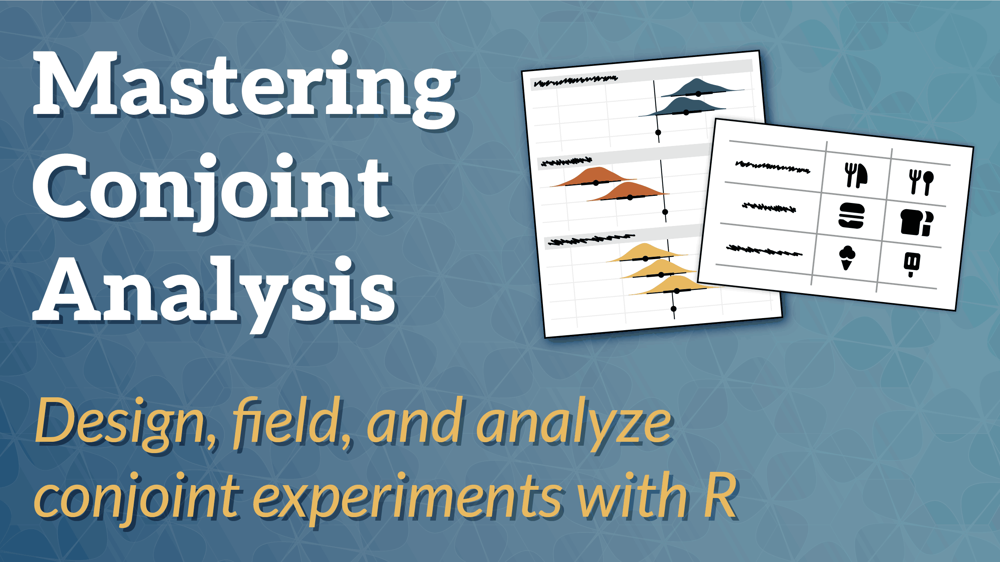

Workshop materials for Andrew Heiss's ["Mastering Conjoint Analysis"](https://andrewheiss.github.io/mastering-conjoint-analysis_2026-06/) Statistical Horizons course in June 2026. Contains Quarto files for each day's exercises (along with answer keys for each).

